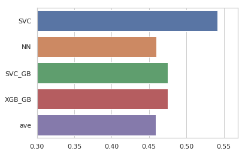

### DrugBank Database

 

The DrugBank database is a comprehensive database containing information on drugs and drug targets.

https://www.drugbank.ca/about

### Parsing

Parsing of Drugbank database using Python can be found in the below two links.

https://github.com/dhimmel/drugbank
https://github.com/choderalab/nano-drugbank

### Molecular Descriptors

Only approved drugs (Small molecules) with SMILES and Description are used in the classification model, i.e. for 
1242 drugs. Molecular descriptors are calculated using the Mordred python module.

https://github.com/mordred-descriptor/mordred

### Classification

The drugs are classified in two ways:
Mechanism of action and Therapeutic class

### Models

SKLearn SVC, Keras NN and XGBoost are used the classification.

### Python Code

All the python notebook code can be found in scripts folder.

### Results

 
Figure 1. <b>ROC-AUC</b> – Classification based on the Mechanism of Action.

 
Figure 2. <b> ROC-AUC</b> – Classification based on Therapeutic class.

### Citation

Wishart DS, Feunang YD, Guo AC, Lo EJ, Marcu A, Grant JR, Sajed T, Johnson D, Li C, Sayeeda Z, Assempour N, Iynkkaran I, Liu Y, Maciejewski A, Gale N, Wilson A, Chin L, Cummings R, Le D, Pon A, Knox C, Wilson M. DrugBank 5.0: a major update to the DrugBank database for 2018. Nucleic Acids Res. 2017 Nov 8. doi: 10.1093/nar/gkx1037.

Moriwaki H, Tian Y-S, Kawashita N, Takagi T (2018) Mordred: a molecular descriptor calculator. Journal of Cheminformatics 10:4 . doi: 10.1186/s13321-018-0258-y
